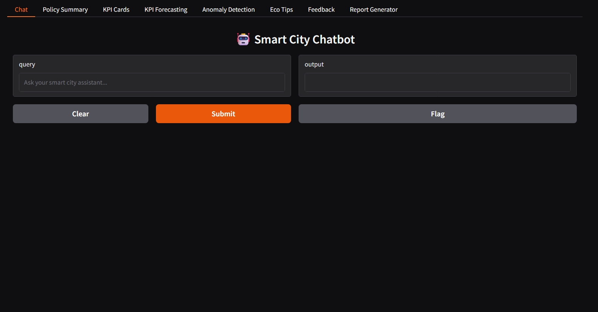
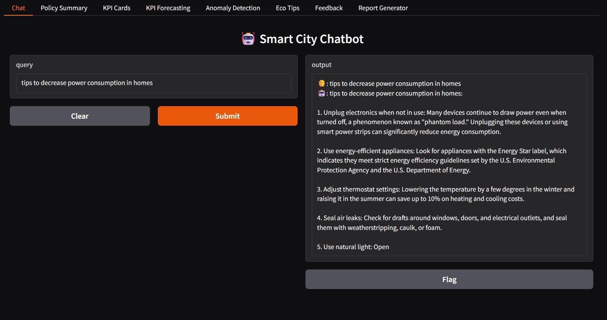
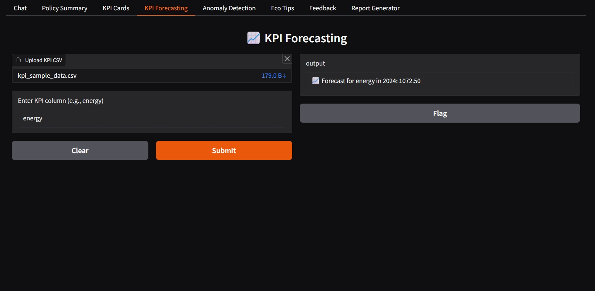
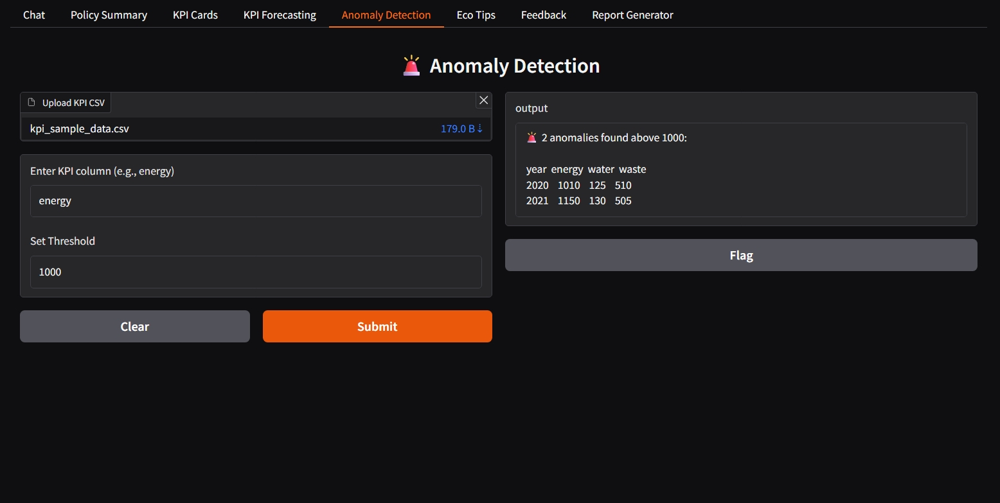
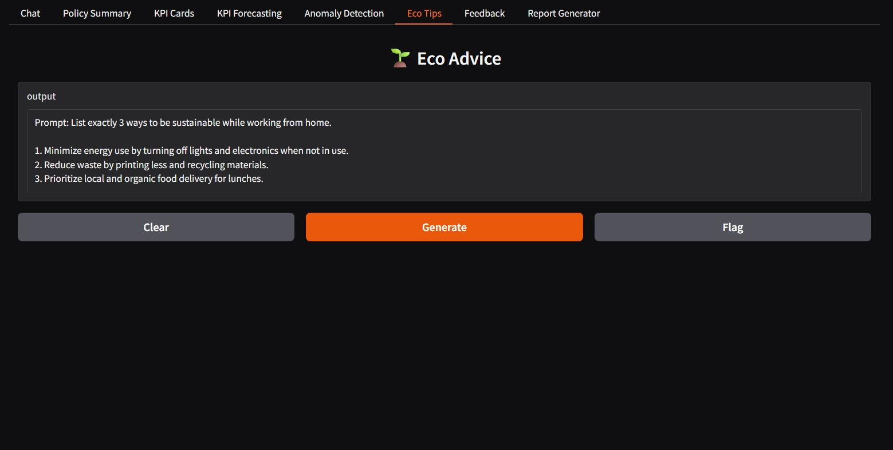

# 🌆 Sustainable Smart City Assistant

  
An AI-powered, interactive Gradio-based tool to support smart urban sustainability, policy summarization, anomaly detection, KPI forecasting, citizen feedback, and more — all running efficiently in Google Colab using large language models like IBM Granite and Mistral.

---

## 🚀 Features

| Module                   | Description                                                             |
| ------------------------ | ----------------------------------------------------------------------- |
| 🤖 Chat Assistant        | Ask sustainability or policy-related queries and get smart AI responses |
| 📄 PDF Summarizer        | Upload policy documents to generate short summaries using LLMs          |
| 📊 KPI Forecasting       | Upload KPI CSV data to forecast water, waste, or energy usage           |
| 🚨 Anomaly Detection     | Identify sudden spikes or anomalies in CSV-based KPI data               |
| 🌱 Eco Tips Generator    | Get daily random actionable eco-friendly tips                           |
| 📝 Feedback System       | Users can submit and view feedback in the same session                  |
| 📈 KPI Dashboard Cards   | Display key city metrics (Air Quality, Water Use, Recycling Rate, etc.) |
| 🖨️ PDF Report Generator | Generate clean PDF summaries of your smart city insights                |

---

## 🛠️ Tech Stack

- **LLMs:** IBM Granite 2B
- **Interface:** Gradio Tabbed UI (Colab-friendly)
- **Data:** CSV (KPI), PDF (Policy), Text Inputs
- **ML Algorithms:** Linear Regression for forecasting, Rule-based anomaly detection
- **Libraries:**
  - `transformers`, `torch`, `scikit-learn`
  - `PyMuPDF`, `FPDF`, `pandas`, `numpy`

---

## 💡 How to Run in Google Colab

1. **Clone or Upload Code** into a Colab notebook
2. **Install Required Packages**:
   ```python
   !pip install gradio transformers torch scikit-learn pandas numpy fpdf pymupdf
   ```
3. **Run the Gradio App**:
   ```python
   gr.TabbedInterface([...]).launch(share=True)
   ```
4. Upload sample PDFs or CSVs (provided) to test different modules.

---

## 📁 Sample Files for Testing

- ✅ `sample_kpi.csv`: Test forecasting & anomaly detection
- ✅ `city_policy.pdf`: Try the PDF summarizer
- ✅ `eco_tips_prompt`: Use in chat or eco advice module

---

## 📸 Screenshots

- 🏠Dashboard


- 🤖 Chatbot Reply


- 📊 KPI Forecasting


- 🚨 Anomaly Detection


- 🌱 Eco Tips


---

## 👨‍💻 Team – TEAM 175

| Name                        | Email                                                      |
| --------------------------- | ---------------------------------------------------------- |
| Vakkalanka Bhanu Karthikeya | [22P31A0552@acet.ac.in](mailto:22P31A0552@acet.ac.in)      |
| Vigneswara Reddy Sabbella   | [ysabbella@gmail.com](mailto\:ysabbella@gmail.com)         |
| Abhinav Kumar               | [abhinavkr1003@gmail.com](mailto\:abhinavkr1003@gmail.com) |
| Absar Ahmad                 | [absar4395@gmail.com](mailto\:absar4395@gmail.com)         |

- 🎓 **College:** Aditya College of Engineering and Technology (ID: 161)
- 🛠️ **Track:** Generative AI with IBM Cloud

---

## 🌍 Future Enhancements

- 🧠 Add vector database (e.g., FAISS) for semantic search
- 📡 Backend with database for persistent feedback tracking
- 📊 Integrate real-time smart city sensors (IoT data streaming)
- 🎯 Add dashboard analytics (using Plotly/Altair)

---

## 📜 License

This project is developed for academic purposes under the IBM SkillsBuild Generative AI track. All third-party models and libraries are used with proper attribution.

---

✅ *Build sustainable futures using the power of AI — one city at a time.*

